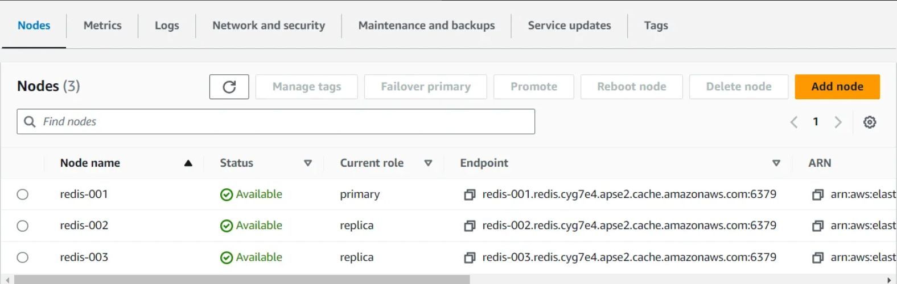

# 🚀 AWS ElastiCache Redis 設定指南

## 📖 目錄

- [1. AWS 設定](#1-aws-設定)
  - [1.1 設定步驟](#11-設定步驟)
  - [1.2 MySetup 個人設定](#12-mysetup-個人設定)
- [2. VPC 虛擬私有雲設定](#2-vpc-虛擬私有雲設定)
- [3. Security Group 安全群組](#3-security-group-安全群組)
- [4. Inbound Rules 入站規則](#4-inbound-rules-入站規則)
- [5. Outbound Rules 出站規則](#5-outbound-rules-出站規則)
- [6. 在機器上安裝 Redis CLI](#6-在機器上安裝-redis-cli)
  - [6.1 安裝步驟](#61-安裝步驟)
  - [6.2 連線到 ElastiCache](#62-連線到-elasticache)
  - [6.3 TLS 安全連線說明](#63-tls-安全連線說明)
  - [6.4 Redis 基本操作](#64-redis-基本操作)
  - [6.5 連線診斷與監控](#65-連線診斷與監控)

---

## 1. AWS 設定

### 1.1 設定步驟

#### 🔧 **ElastiCache 建立流程**

以下是在 AWS 主控台建立 ElastiCache Redis 叢集的基本步驟：

**步驟一：建立 Redis 叢集**


**步驟二：設定叢集參數**


**步驟三：完成設定**


#### 📊 **服務監控**

如果你的應用程式部署在 AWS EC2 上，可以使用以下指令監聽應用程式日誌，判斷程式是否正常運作：

```bash
$ journalctl -fu stylish_api.service
```

> **💡 提示**：這個指令會即時顯示 `stylish_api.service` 的日誌輸出，對於除錯和監控非常有用。

### 1.2 MySetup 個人設定

#### ⚙️ **個人化設定範例**

以下是針對特定需求的 ElastiCache 設定範例：

**設定畫面一：基本組態**


**設定畫面二：進階選項**


**設定畫面三：安全設定**


## 2. VPC 虛擬私有雲設定

### 🌐 **確保網路連通性**

在設定 ElastiCache 時，最重要的是確保你的 EC2 執行個體和 ElastiCache 叢集位於相同的 VPC 中。

#### 🔍 **檢查要點**

- ✅ **相同 VPC**：EC2 和 ElastiCache 必須在同一個 VPC 內
- ✅ **子網路設定**：確保子網路設定正確
- ✅ **路由表**：檢查路由表是否允許內部通訊
- ✅ **可用區域**：建議選擇相同的可用區域以降低延遲

```bash
# 檢查 VPC 設定的指令範例
aws ec2 describe-vpcs
aws elasticache describe-cache-clusters --show-cache-node-info
```

## 3. Security Group 安全群組

### 🛡️ **防火牆設定**

Security Group 就像是 AWS 資源的防火牆，控制著網路流量的進出。

#### 🎯 **核心功能**

- 🔒 **狀態檢查防火牆**：自動追蹤連線狀態
- 🚪 **入站流量控制**：決定哪些流量可以進入資源
- 🚪 **出站流量控制**：決定哪些流量可以離開資源
- 🔐 **預設拒絕**：除非明確允許，否則預設拒絕所有流量

#### 📋 **最佳實務**

1. **最小權限原則**：只開放必要的 port 和來源
2. **明確命名**：使用有意義的 Security Group 名稱
3. **定期檢查**：定期審查和更新規則
4. **文件記錄**：記錄每個規則的用途

## 4. Inbound Rules 入站規則

### 🔽 **控制進入流量**

入站規則決定哪些外部流量可以到達你的 ElastiCache 叢集。

#### ⚙️ **Redis 預設設定**

```
類型: Custom TCP
協定: TCP
Port: 6379
來源: 你的 EC2 Security Group ID
描述: Allow Redis access from application servers
```

#### 🎯 **常見 Port 設定**

| Port | 用途 | 說明 |
|------|------|------|
| `6379` | Redis 預設 Port | 標準 Redis 連線 |
| `80` | HTTP | 網站流量 |
| `443` | HTTPS | 加密網站流量 |
| `22` | SSH | 遠端管理 |

#### 📝 **設定範例**

```bash
# 只允許特定 EC2 群組存取 Redis
Type: Custom TCP Rule
Protocol: TCP
Port Range: 6379
Source: sg-xxxxxxxxx (你的 EC2 Security Group)
```

> **⚠️ 安全提醒**：絕對不要將 Redis port (6379) 開放給 `0.0.0.0/0`，這會讓你的 Redis 暴露在公網上！

## 5. Outbound Rules 出站規則

### 🔼 **控制離開流量**

出站規則控制從你的資源發出的網路流量。

#### 🌐 **預設設定**

AWS 預設允許所有出站流量，但在高安全性環境中，你可能需要限制出站連線：

```bash
# 限制性出站規則範例
Type: HTTPS
Protocol: TCP  
Port: 443
Destination: 0.0.0.0/0
Description: Allow HTTPS outbound for updates

Type: Custom TCP
Protocol: TCP
Port: 6379  
Destination: sg-elasticache-xxxx
Description: Allow Redis communication
```

#### 🎯 **常見出站需求**

- 📡 **軟體更新**：需要存取套件儲存庫
- 🔄 **API 呼叫**：連接外部服務
- 📧 **郵件服務**：發送通知郵件
- 📊 **監控服務**：上傳監控資料

## 6. 在機器上安裝 Redis CLI

### 6.1 安裝步驟

#### 📦 **Ubuntu/Debian 系統安裝**

```bash
# 更新套件清單
sudo apt update

# 安裝 Redis CLI
sudo apt-get install redis-tools
```

#### 🔍 **其他系統安裝**

```bash
# CentOS/RHEL
sudo yum install redis

# macOS (使用 Homebrew)
brew install redis

# 驗證安裝
redis-cli --version
```

### 6.2 連線到 ElastiCache

#### 🔗 **基本連線指令**

```bash
# 連線到 ElastiCache Redis (使用 TLS)
sudo redis-cli -h master.redis.cgmc5z.apne1.cache.amazonaws.com -p 6379 -a Ag1314579j468kkk --tls
```

#### 📋 **連線參數說明**

| 參數 | 說明 | 範例 |
|------|------|------|
| `-h` | Redis 主機位址 | `master.redis.cgmc5z.apne1.cache.amazonaws.com` |
| `-p` | Port 號碼 | `6379` |
| `-a` | 密碼驗證 | `Ag1314579j468kkk` |
| `--tls` | 啟用 TLS 加密 | 無值參數 |

### 6.3 TLS 安全連線說明

#### 🔐 **為什麼使用 TLS？**

```bash
--tls: Enables the use of TLS (Transport Layer Security) for secure communication.
```

**TLS 的重要性：**
- 🛡️ **資料加密**：確保資料在傳輸過程中被加密
- 🔒 **身份驗證**：驗證伺服器身份，防止中間人攻擊  
- 🔐 **資料完整性**：確保資料在傳輸過程中未被篡改
- 📜 **法規遵循**：符合企業安全標準和法規要求

#### ⚙️ **TLS 設定要點**

```bash
# TLS = Transport Layer Security
# 提供端到端的安全通訊
# AWS ElastiCache 建議在正式環境中啟用 TLS
```

### 6.4 Redis 基本操作

#### 💻 **進入 Redis CLI 後的基本指令**

**設定資料：**
```redis
# 設定字串值
set name xxx
set city taipei  
set pin 123
set mobile 321
```

**讀取資料：**
```redis
# 取得值
get name
get city
get pin
```

**管理指令：**
```redis
# 檢視所有鍵值
keys *

# 掃描鍵值（推薦用於正式環境）
SCAN 0

# 刪除鍵值
del name
del city
```

#### 📊 **實用操作範例**

```redis
# 設定帶過期時間的鍵值
SETEX user:123 3600 "Allen Lin"  # 3600 秒後過期

# 檢查鍵值是否存在
EXISTS name

# 檢查鍵值類型
TYPE name

# 取得所有鍵值的數量
DBSIZE

# 清空當前資料庫
FLUSHDB

# 查看 Redis 資訊
INFO
```

### 6.5 連線診斷與監控

#### 🔍 **檢查 Redis 程序**

```bash
# 檢查本機 Redis 程序
ps -ef | grep redis
```

#### 🌐 **網路連線測試**

```bash
# 測試網路連通性
ping master.redis.cgmc5z.apne1.cache.amazonaws.com

# 測試特定 Port (需要安裝 telnet)
telnet master.redis.cgmc5z.apne1.cache.amazonaws.com 6379

# 使用 nc (netcat) 測試連線
nc -zv master.redis.cgmc5z.apne1.cache.amazonaws.com 6379
```

#### 📊 **連線狀態監控**

```bash
# 在 Redis CLI 中監控即時指令
MONITOR

# 檢查連線資訊
CLIENT LIST

# 檢查 Redis 效能統計
INFO stats

# 檢查記憶體使用情況
INFO memory
```

#### 🔧 **疑難排解**

**常見問題與解決方案：**

| 問題 | 可能原因 | 解決方案 |
|------|----------|----------|
| 連線逾時 | Security Group 設定錯誤 | 檢查入站規則是否開放 6379 port |
| 認證失敗 | 密碼錯誤 | 確認 Auth Token 正確 |
| TLS 錯誤 | TLS 設定問題 | 確認 ElastiCache 已啟用 TLS |
| 網路不通 | VPC/子網路設定 | 確認 EC2 和 ElastiCache 在同一 VPC |

**除錯指令範例：**
```bash
# 檢查 DNS 解析
nslookup master.redis.cgmc5z.apne1.cache.amazonaws.com

# 檢查路由
traceroute master.redis.cgmc5z.apne1.cache.amazonaws.com

# 檢查防火牆狀態
sudo ufw status
```

> **🌟 重點提醒**
> 
> 1. **安全性優先**：始終使用 TLS 加密和強密碼
> 2. **網路隔離**：確保 ElastiCache 只能從授權的資源存取
> 3. **監控機制**：定期檢查連線狀態和效能指標
> 4. **備份策略**：設定自動備份和災難復原計畫
> 5. **成本最佳化**：選擇適合的執行個體類型和容量規劃