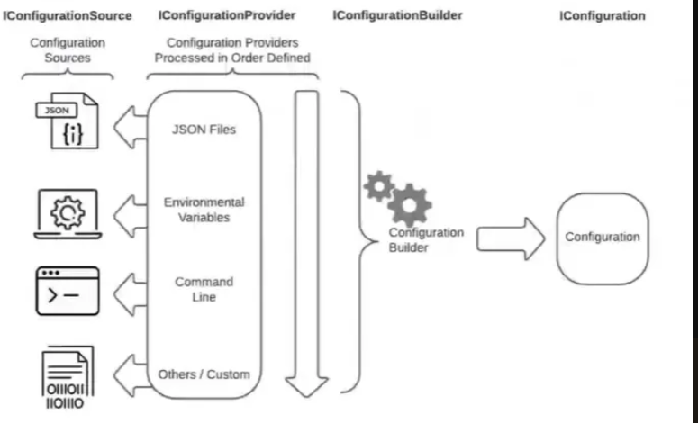

# C# 配置管理指南

## 目錄
- [1. 讓 appsetting 作用起來](#1-讓-appsetting-作用起來)
- [2. WebAPI Config Json file 設定](#2-webapi-config-json-file-設定)
- [3. Console APP Json file 設定](#3-console-app-json-file-設定)
- [4. EnvironmentVariables](#4-environmentvariables)
- [5. AddCommandLine(args)](#5-addcommandlineargs)
- [6. 自訂組態來源（Custom Configuration Source）](#6-自訂組態來源custom-configuration-source)
- [7. 取值方式差異](#7-取值方式差異)
- [8. 環境](#8-環境)

---

## 1. 讓 appsetting 作用起來

確保無論你的應用程式在開發環境還是發布後的環境中執行，appsettings.json 檔案都會被複製到應用程式的輸出目錄中。這樣，當你的應用程式執行時，它可以找到並讀取這個配置檔案。

### 🔧 **設定方法**

**步驟一：設定檔案複製屬性**
1. 在 Visual Studio 中，找到你的 `appsettings.json` 檔案
2. 右鍵點擊 `appsettings.json` 檔案
3. 選擇 **Properties** (屬性)
4. 在屬性視窗中，將 **Copy to Output Directory** 設定為 **Copy always** (一律複製)

### 📝 **詳細說明**

當你設定 **Copy to Output Directory** 為 **Copy always** 時：

- ✅ **開發環境**：appsettings.json 會自動複製到 `bin/Debug` 或 `bin/Release` 目錄
- ✅ **發布環境**：檔案會包含在發布的輸出中
- ✅ **部署環境**：應用程式可以正確讀取配置設定

### 🎯 **替代設定方法**

**方法一：透過專案檔(.csproj)設定**
```xml
<Project Sdk="Microsoft.NET.Sdk">
  <PropertyGroup>
    <TargetFramework>net8.0</TargetFramework>
  </PropertyGroup>
  
  <ItemGroup>
    <None Update="appsettings.json">
      <CopyToOutputDirectory>Always</CopyToOutputDirectory>
    </None>
    <None Update="appsettings.Development.json">
      <CopyToOutputDirectory>Always</CopyToOutputDirectory>
    </None>
    <None Update="appsettings.Production.json">
      <CopyToOutputDirectory>Always</CopyToOutputDirectory>
    </None>
  </ItemGroup>
</Project>
```

**方法二：設定為 Copy if newer**
如果你不想每次都複製檔案，可以選擇 **Copy if newer** (有更新時才複製)：
```xml
<None Update="appsettings.json">
  <CopyToOutputDirectory>PreserveNewest</CopyToOutputDirectory>
</None>
```

### ⚡ **常見問題與解決方案**

**問題一：配置檔案找不到**
```csharp
// ❌ 可能發生的錯誤
System.IO.FileNotFoundException: Could not find file 'appsettings.json'
```

**解決方案：**
- 確認 appsettings.json 的 Copy to Output Directory 設定正確
- 檢查檔案是否存在於執行目錄中
- 確認檔案名稱拼寫正確

**問題二：配置更新後沒有生效**
```csharp
// 確保配置檔案被正確載入
var builder = new ConfigurationBuilder()
    .SetBasePath(Directory.GetCurrentDirectory())
    .AddJsonFile("appsettings.json", optional: false, reloadOnChange: true)
    .AddJsonFile($"appsettings.{Environment.GetEnvironmentVariable("ASPNETCORE_ENVIRONMENT") ?? "Production"}.json", optional: true)
    .Build();
```

### 🏆 **最佳實踐建議**

1. **環境特定配置**：為不同環境建立不同的配置檔案
   - `appsettings.json` (基礎配置)
   - `appsettings.Development.json` (開發環境)
   - `appsettings.Production.json` (生產環境)

2. **敏感資訊處理**：
   - 開發環境使用 User Secrets
   - 生產環境使用環境變數或 Azure Key Vault

3. **配置驗證**：
   ```csharp
   // 在 Startup.cs 或 Program.cs 中驗證配置
   services.Configure<MyAppSettings>(configuration.GetSection("MyApp"));
   services.PostConfigure<MyAppSettings>(settings =>
   {
       if (string.IsNullOrEmpty(settings.ImportantSetting))
           throw new InvalidOperationException("ImportantSetting 不能為空");
   });
   ```

> **🌟 重點提醒**
> 
> - **一律複製**：對於配置檔案，建議使用 "Copy always" 確保部署時包含所有必要檔案
> - **環境區分**：使用不同的 appsettings 檔案來管理不同環境的配置
> - **安全考量**：避免在配置檔案中直接儲存敏感資訊，使用適當的密鑰管理方案

---

## 2. WebAPI Config Json file 設定

在 ASP.NET Core WebAPI 專案中，除了預設的 appsettings.json 之外，你可能需要自訂配置檔案的位置或新增其他 JSON 設定檔。WebApplicationBuilder 已經提供了便利的配置建構器，讓你可以輕鬆擴展配置來源。

### 🔧 **基本設定方式**

```csharp
var builder = WebApplication.CreateBuilder(args);

builder.Configuration
       .SetBasePath(Path.Combine(builder.Environment.ContentRootPath, "Configuration"))
       .AddJsonFile("settings.json", optional: false, reloadOnChange: true);

var app = builder.Build();
```

### 📌 **使用情境**

- ✅ **自訂設定路徑**：想要將配置檔案放在特定的資料夾中
- ✅ **新增其他 JSON 設定檔**：除了 appsettings.json 外，還需要其他配置檔案
- ✅ **模組化配置**：將不同功能的配置分散到不同檔案中
- ✅ **第三方服務配置**：為不同的外部服務建立專用配置檔案

### 💡 **關鍵特點**

- `builder.Configuration` 是系統已經幫你準備好的設定建構器
- `builder.Configuration` 是在 ASP.NET Core 裡面專用的配置方式
- `WebApplicationBuilder` 已經整合了 DI 容器與其他核心設定

### 🎯 **進階配置範例**

**範例一：多重配置檔案載入**
```csharp
var builder = WebApplication.CreateBuilder(args);

// 設定自訂配置目錄
var configPath = Path.Combine(builder.Environment.ContentRootPath, "Configuration");

builder.Configuration
    .SetBasePath(configPath)
    .AddJsonFile("database.json", optional: false, reloadOnChange: true)
    .AddJsonFile("redis.json", optional: false, reloadOnChange: true)
    .AddJsonFile("external-apis.json", optional: false, reloadOnChange: true)
    .AddJsonFile($"settings.{builder.Environment.EnvironmentName}.json", optional: true, reloadOnChange: true);

var app = builder.Build();
```

**範例二：條件式配置載入**
```csharp
var builder = WebApplication.CreateBuilder(args);

// 根據環境載入不同的配置檔案
if (builder.Environment.IsDevelopment())
{
    builder.Configuration.AddJsonFile("development-settings.json", optional: true);
}
else if (builder.Environment.IsProduction())
{
    builder.Configuration.AddJsonFile("production-settings.json", optional: false);
}

// 載入功能特定的配置
builder.Configuration
    .AddJsonFile("logging.json", optional: true)
    .AddJsonFile("security.json", optional: true);

var app = builder.Build();
```

**範例三：配置驗證與選項模式**
```csharp
var builder = WebApplication.CreateBuilder(args);

builder.Configuration
    .SetBasePath(Path.Combine(builder.Environment.ContentRootPath, "Config"))
    .AddJsonFile("api-settings.json", optional: false, reloadOnChange: true);

// 註冊強型別配置
builder.Services.Configure<ApiSettings>(
    builder.Configuration.GetSection("ApiSettings"));

// 配置驗證
builder.Services.PostConfigure<ApiSettings>(settings =>
{
    if (string.IsNullOrEmpty(settings.BaseUrl))
        throw new InvalidOperationException("API BaseUrl 不能為空");
    
    if (settings.Timeout <= 0)
        throw new InvalidOperationException("API Timeout 必須大於0");
});

var app = builder.Build();

// 配置類別定義
public class ApiSettings
{
    public string BaseUrl { get; set; } = string.Empty;
    public int Timeout { get; set; }
    public string ApiKey { get; set; } = string.Empty;
}
```

### 📁 **目錄結構範例**

```
MyWebAPI/
├── Configuration/
│   ├── database.json
│   ├── redis.json
│   ├── external-apis.json
│   └── settings.Production.json
├── Controllers/
├── Services/
├── Program.cs
└── appsettings.json
```

---

## 3. Console APP Json file 設定

在 Console 應用程式中，你需要自己手動建立配置建構器來載入 JSON 配置檔案。這種方式提供了完全的控制權，讓你可以自由決定配置檔案的位置、載入順序和處理方式。

### 🔧 **基本設定方式**

```csharp
using Microsoft.Extensions.Configuration;

IConfigurationRoot config = new ConfigurationBuilder()
    .SetBasePath(Environment.CurrentDirectory)
    .AddJsonFile("config.json")
    .Build();

string value = config["MySetting"];
```

### 📌 **使用情境**

- ✅ **自己寫的 Console 工具**：需要讀取配置的命令列工具
- ✅ **沒有 WebApplicationBuilder 可用**：非 ASP.NET Core 環境
- ✅ **自己決定設定檔位置**：完全控制配置檔案的路徑和名稱
- ✅ **輕量級應用程式**：不需要完整的 Web 框架功能

### 🎯 **完整範例**

**範例一：基本 Console 配置**
```csharp
using Microsoft.Extensions.Configuration;
using Microsoft.Extensions.DependencyInjection;
using Microsoft.Extensions.Logging;

class Program
{
    static void Main(string[] args)
    {
        // 建立配置
        IConfigurationRoot config = new ConfigurationBuilder()
            .SetBasePath(Environment.CurrentDirectory)
            .AddJsonFile("config.json", optional: false, reloadOnChange: true)
            .AddJsonFile("secrets.json", optional: true)
            .AddEnvironmentVariables()
            .AddCommandLine(args)
            .Build();
        
        // 讀取配置值
        string connectionString = config.GetConnectionString("DefaultConnection");
        string apiKey = config["ApiSettings:ApiKey"];
        int timeout = config.GetValue<int>("ApiSettings:Timeout");
        
        Console.WriteLine($"Connection: {connectionString}");
        Console.WriteLine($"API Key: {apiKey}");
        Console.WriteLine($"Timeout: {timeout}");
    }
}
```

**範例二：使用強型別配置**
```csharp
using Microsoft.Extensions.Configuration;
using Microsoft.Extensions.DependencyInjection;
using Microsoft.Extensions.Options;

class Program
{
    static void Main(string[] args)
    {
        // 建立配置
        var config = new ConfigurationBuilder()
            .SetBasePath(Directory.GetCurrentDirectory())
            .AddJsonFile("appsettings.json")
            .Build();
        
        // 設定 DI 容器
        var services = new ServiceCollection();
        
        // 註冊配置
        services.Configure<AppSettings>(config.GetSection("AppSettings"));
        services.Configure<DatabaseSettings>(config.GetSection("Database"));
        
        // 註冊服務
        services.AddSingleton<IMyService, MyService>();
        services.AddLogging();
        
        // 建立服務提供者
        var serviceProvider = services.BuildServiceProvider();
        
        // 使用服務
        var myService = serviceProvider.GetRequiredService<IMyService>();
        myService.DoSomething();
    }
}

// 配置類別
public class AppSettings
{
    public string ApplicationName { get; set; } = string.Empty;
    public string Version { get; set; } = string.Empty;
    public LogLevel LogLevel { get; set; } = LogLevel.Information;
}

public class DatabaseSettings
{
    public string ConnectionString { get; set; } = string.Empty;
    public int CommandTimeout { get; set; } = 30;
    public bool EnableRetry { get; set; } = true;
}

// 服務實作
public interface IMyService
{
    void DoSomething();
}

public class MyService : IMyService
{
    private readonly AppSettings _appSettings;
    private readonly DatabaseSettings _dbSettings;
    
    public MyService(IOptions<AppSettings> appSettings, IOptions<DatabaseSettings> dbSettings)
    {
        _appSettings = appSettings.Value;
        _dbSettings = dbSettings.Value;
    }
    
    public void DoSomething()
    {
        Console.WriteLine($"應用程式: {_appSettings.ApplicationName} v{_appSettings.Version}");
        Console.WriteLine($"資料庫逾時: {_dbSettings.CommandTimeout} 秒");
    }
}
```

**範例三：錯誤處理與配置驗證**
```csharp
using Microsoft.Extensions.Configuration;

class Program
{
    static void Main(string[] args)
    {
        try
        {
            var config = BuildConfiguration();
            ValidateConfiguration(config);
            
            // 執行主要邏輯
            RunApplication(config);
        }
        catch (FileNotFoundException ex)
        {
            Console.WriteLine($"配置檔案不存在: {ex.Message}");
            Environment.Exit(1);
        }
        catch (InvalidOperationException ex)
        {
            Console.WriteLine($"配置驗證失敗: {ex.Message}");
            Environment.Exit(1);
        }
        catch (Exception ex)
        {
            Console.WriteLine($"應用程式執行失敗: {ex.Message}");
            Environment.Exit(1);
        }
    }
    
    static IConfigurationRoot BuildConfiguration()
    {
        var configPath = Path.Combine(AppDomain.CurrentDomain.BaseDirectory, "config");
        
        return new ConfigurationBuilder()
            .SetBasePath(configPath)
            .AddJsonFile("app.json", optional: false, reloadOnChange: false)
            .AddJsonFile($"app.{GetEnvironment()}.json", optional: true)
            .AddEnvironmentVariables("MYAPP_")
            .Build();
    }
    
    static void ValidateConfiguration(IConfiguration config)
    {
        // 檢查必要的配置項目
        var requiredSettings = new[] { "Database:ConnectionString", "Api:BaseUrl", "Api:ApiKey" };
        
        foreach (var setting in requiredSettings)
        {
            if (string.IsNullOrEmpty(config[setting]))
                throw new InvalidOperationException($"必要設定 '{setting}' 未配置");
        }
        
        // 檢查數值範圍
        var timeout = config.GetValue<int>("Api:Timeout");
        if (timeout <= 0 || timeout > 300)
            throw new InvalidOperationException("API Timeout 必須在 1-300 秒之間");
    }
    
    static string GetEnvironment()
    {
        return Environment.GetEnvironmentVariable("ENVIRONMENT") ?? "Production";
    }
    
    static void RunApplication(IConfiguration config)
    {
        Console.WriteLine("應用程式啟動成功");
        Console.WriteLine($"環境: {GetEnvironment()}");
        Console.WriteLine($"API 端點: {config["Api:BaseUrl"]}");
        
        // 主要業務邏輯
    }
}
```

### 📁 **設定檔範例**

**config.json**
```json
{
  "AppSettings": {
    "ApplicationName": "MyConsoleApp",
    "Version": "1.0.0",
    "LogLevel": "Information"
  },
  "Database": {
    "ConnectionString": "Server=localhost;Database=MyDB;Trusted_Connection=true;",
    "CommandTimeout": 30,
    "EnableRetry": true
  },
  "Api": {
    "BaseUrl": "https://api.example.com",
    "ApiKey": "your-api-key",
    "Timeout": 30
  }
}
```

### 🏆 **Console 應用程式配置最佳實踐**

1. **錯誤處理**：始終包含配置載入的錯誤處理
2. **環境支援**：支援不同環境的配置檔案
3. **命令列參數**：允許透過命令列覆蓋配置
4. **配置驗證**：在應用程式啟動時驗證關鍵配置
5. **相對路徑**：使用相對於執行檔的路徑載入配置

> **🌟 重點提醒**
> 
> - **WebAPI vs Console**：WebAPI 使用 `builder.Configuration`，Console 需要手動建立 `ConfigurationBuilder`
> - **DI 整合**：Console 應用程式如需使用 DI，需要手動設定 `ServiceCollection`
> - **檔案路徑**：注意配置檔案的路徑設定，確保在不同執行環境下都能正確載入
> - **環境變數**：善用環境變數來覆蓋敏感配置，提升安全性

---

## 4. EnvironmentVariables

環境變數是一個強大的配置來源，特別適合用在部署環境中傳遞敏感資訊或動態設定。透過 `.AddEnvironmentVariables()` 方法，你可以讓應用程式讀取系統的環境變數作為配置值。

### 🔧 **基本設定方式**

在目前這個 PowerShell 執行階段中，設定一個叫做 environment 的變數，它的值是 "evv"：

**PowerShell 設定環境變數：**
```powershell
$env:environment="evv"
```

**Console 應用程式讀取：**
```csharp
using Microsoft.Extensions.Configuration;

Console.WriteLine("Hello, World!");

IConfigurationRoot configuration = new ConfigurationBuilder()
    .SetBasePath(Environment.CurrentDirectory)
    .AddJsonFile("config.json")
    .AddEnvironmentVariables()
    .Build();

Console.WriteLine(configuration["greeting"]);
Console.WriteLine(configuration["environment"]);
```

### 📌 **使用情境**

- ✅ **部署環境配置**：在不同的部署環境中設定不同的連線字串
- ✅ **敏感資訊管理**：避免將 API 金鑰等敏感資料寫在配置檔案中
- ✅ **CI/CD 管道**：在建置或部署過程中動態傳遞配置
- ✅ **容器化部署**：在 Docker 容器中透過環境變數傳遞配置

### 💡 **環境變數的優先權**

配置來源有優先權順序，後載入的會覆蓋先載入的：

```csharp
var configuration = new ConfigurationBuilder()
    .AddJsonFile("config.json")      // 優先權：低
    .AddEnvironmentVariables()       // 優先權：中
    .AddCommandLine(args)           // 優先權：高
    .Build();
```

### 🎯 **進階範例**

**範例一：環境變數前綴過濾**
```csharp
// 只載入以 "MYAPP_" 開頭的環境變數
var configuration = new ConfigurationBuilder()
    .AddJsonFile("appsettings.json")
    .AddEnvironmentVariables("MYAPP_")
    .Build();

// 環境變數：MYAPP_Database__ConnectionString
// 讀取方式：configuration["Database:ConnectionString"]
```

**範例二：不同環境的設定**
```powershell
# 開發環境
$env:ASPNETCORE_ENVIRONMENT="Development"
$env:Database__ConnectionString="Server=localhost;Database=DevDB;Trusted_Connection=true;"
$env:Redis__ConnectionString="localhost:6379"

# 生產環境
$env:ASPNETCORE_ENVIRONMENT="Production"
$env:Database__ConnectionString="Server=prod-server;Database=ProdDB;Trusted_Connection=false;User=sa;Password=SecretPassword;"
$env:Redis__ConnectionString="prod-redis:6379"
```

**範例三：巢狀配置結構**
```csharp
// PowerShell 設定
// $env:Api__Settings__BaseUrl="https://api.production.com"
// $env:Api__Settings__Timeout="60"
// $env:Api__Settings__ApiKey="prod-api-key-12345"

var configuration = new ConfigurationBuilder()
    .AddEnvironmentVariables()
    .Build();

// 讀取巢狀配置
string baseUrl = configuration["Api:Settings:BaseUrl"];
int timeout = configuration.GetValue<int>("Api:Settings:Timeout");
string apiKey = configuration["Api:Settings:ApiKey"];

Console.WriteLine($"API 端點: {baseUrl}");
Console.WriteLine($"逾時: {timeout} 秒");
Console.WriteLine($"API 金鑰: {apiKey}");
```

### 🏆 **環境變數最佳實踐**

1. **命名規範**：使用應用程式前綴避免衝突
2. **敏感資料**：將密碼、API 金鑰等放在環境變數中
3. **分層結構**：使用 `__` (雙底線) 表示階層關係
4. **文件化**：清楚記錄需要哪些環境變數

---

## 5. AddCommandLine(args)

命令列參數讓你可以在執行應用程式時動態傳遞配置值，非常適合用於測試、調試或在不修改配置檔案的情況下快速調整設定。

### 🔧 **基本用法**

```bash
dotnet run --greeting=Hello --environment=prod
```

這會對應到：
```csharp
configuration["greeting"]    // "Hello"
configuration["environment"] // "prod"
```

### 📌 **支援的命令列格式**

| 寫法                      | 是否支援 | 說明                                  |
| ----------------------- | ---- | ----------------------------------- |
| `--key=value`           | ✅ 支援 | 推薦用法                                |
| `/key=value`            | ✅ 支援 | Windows 的老寫法                        |
| `--key value`           | ✅ 支援 | 分開寫也可以                              |
| `key=value`             | ❌ 不支援 | 不加 `--` 或 `/` 不會被解析                 |
| `--section:sub=value`   | ✅ 支援 | 支援巢狀結構                              |
| `--section__sub=value`  | ✅ 支援 | 替代冒號 `:` 的寫法（給不支援冒號的 shell 用）      |

### 🎯 **實際應用場景**

| 使用情境                   | 你會這樣做                                          |
| ---------------------- | ---------------------------------------------- |
| 測試時快速指定某個設定            | `dotnet run --mode=test`                       |
| 不改 json 檔就改變功能         | `dotnet run --feature:enabled=true`            |
| 在 CI/CD pipeline 傳參數   | `dotnet run --connectionString=$PROD_CONN`     |
| 快速切換語言、主題              | `dotnet run --ui:theme=dark --ui:lang=zh-TW`   |

### 💡 **完整範例**

**程式碼實作：**
```csharp
using Microsoft.Extensions.Configuration;

class Program
{
    static void Main(string[] args)
    {
        var configuration = new ConfigurationBuilder()
            .AddJsonFile("appsettings.json", optional: true)
            .AddEnvironmentVariables()
            .AddCommandLine(args)
            .Build();
        
        // 讀取配置
        string mode = configuration["mode"] ?? "default";
        string theme = configuration["ui:theme"] ?? "light";
        string language = configuration["ui:lang"] ?? "en-US";
        bool featureEnabled = configuration.GetValue<bool>("feature:enabled");
        
        Console.WriteLine($"模式: {mode}");
        Console.WriteLine($"主題: {theme}");
        Console.WriteLine($"語言: {language}");
        Console.WriteLine($"功能啟用: {featureEnabled}");
        
        // 顯示所有命令列參數
        Console.WriteLine("\n收到的命令列參數：");
        foreach (var arg in args)
        {
            Console.WriteLine($"  {arg}");
        }
    }
}
```

**執行範例：**
```bash
# 基本用法
dotnet run --mode=debug --ui:theme=dark

# 複雜巢狀結構
dotnet run --database:connection="Server=localhost" --database:timeout=30

# 布林值設定
dotnet run --feature:enabled=true --debug:verbose=false

# 混合使用不同格式
dotnet run --mode debug /theme=dark --feature:logging=true
```

### 🔍 **命令列參數解析細節**

**範例一：自訂命令列對應**
```csharp
// 自訂命令列鍵值對應
var switchMappings = new Dictionary<string, string>
{
    { "-e", "environment" },
    { "-m", "mode" },
    { "-v", "verbose" }
};

var configuration = new ConfigurationBuilder()
    .AddCommandLine(args, switchMappings)
    .Build();

// 現在可以使用簡短形式：
// dotnet run -e production -m release -v true
```

**範例二：複雜配置結構**
```bash
# 執行命令
dotnet run \
  --database:provider=SqlServer \
  --database:connection="Server=prod;Database=MyApp" \
  --logging:level=Information \
  --features:newUI=true \
  --features:beta=false
```

```csharp
// 對應的讀取方式
string dbProvider = configuration["database:provider"];
string dbConnection = configuration["database:connection"];
string logLevel = configuration["logging:level"];
bool newUI = configuration.GetValue<bool>("features:newUI");
bool beta = configuration.GetValue<bool>("features:beta");
```

### 🏆 **命令列參數最佳實踐**

1. **參數驗證**：檢查必要參數是否提供
2. **說明文件**：提供 `--help` 參數顯示使用說明
3. **預設值**：為所有參數設定合理的預設值
4. **型別轉換**：使用 `GetValue<T>()` 進行型別安全的轉換

---

## 6. 自訂組態來源（Custom Configuration Source）

把你自己的資料來源（像資料庫、Redis）整合進 .NET 的組態系統，這樣你就可以像讀 config.json 一樣，用 `configuration["key"]` 方式來存取這些資料！

### 🏗️ **組態系統的結構**

```
IConfigurationBuilder ➜ IConfigurationSource ➜ IConfigurationProvider ➜ Dictionary<string, string>
```



| 類別名稱                          | 扮演角色  | 本質功能                         |
| ----------------------------- | ----- | ---------------------------- |
| `CustomConfigurationSource`   | 資料來源定義 | 告訴系統「我要加一個自訂來源」              |
| `CustomConfigurationProvider` | 資料提供者 | 負責實際去抓資料，並轉成 Dictionary      |

### 🔧 **實作步驟**

**步驟一：建立 CustomConfigurationSource**
```csharp
using Microsoft.Extensions.Configuration;

public class CustomConfigurationSource : IConfigurationSource
{
    public IConfigurationProvider Build(IConfigurationBuilder builder)
    {
        return new CustomConfigurationProvider();
    }
}
```

**步驟二：建立 CustomConfigurationProvider**
```csharp
using Microsoft.Extensions.Configuration;

public class CustomConfigurationProvider : ConfigurationProvider 
{
    public override void Load()
    {
        Data = new Dictionary<string, string>
        {
            { "Custom:Site:Name", "John Wu's Blog" },
            { "Custom:Site:Domain", "blog.johnwu.cc" }
        };
    }
}
```

**步驟三：加入到應用程式**
```csharp
public static void Main(string[] args)
{
    BuildWebHost(args).Run();
}

public static IWebHost BuildWebHost(string[] args)
{
    return WebHost.CreateDefaultBuilder(args)
        .ConfigureAppConfiguration((hostContext, config) => 
            config.Add(new CustomConfigurationSource()))
        .UseStartup<Startup>()
        .Build();
}
```

**步驟四：讀取**
```csharp
var siteName = _config["Custom:Site:Name"];
```

✅ 這等同於 `.AddJsonFile()`、`.AddEnvironmentVariables()` 只是你自己寫的版本。

### 🎯 **實際應用範例**

**範例一：資料庫配置來源**
```csharp
public class DatabaseConfigurationSource : IConfigurationSource
{
    private readonly string _connectionString;
    
    public DatabaseConfigurationSource(string connectionString)
    {
        _connectionString = connectionString;
    }
    
    public IConfigurationProvider Build(IConfigurationBuilder builder)
    {
        return new DatabaseConfigurationProvider(_connectionString);
    }
}

public class DatabaseConfigurationProvider : ConfigurationProvider
{
    private readonly string _connectionString;
    
    public DatabaseConfigurationProvider(string connectionString)
    {
        _connectionString = connectionString;
    }
    
    public override void Load()
    {
        Data = new Dictionary<string, string>();
        
        using var connection = new SqlConnection(_connectionString);
        connection.Open();
        
        var command = new SqlCommand("SELECT ConfigKey, ConfigValue FROM AppConfigurations", connection);
        using var reader = command.ExecuteReader();
        
        while (reader.Read())
        {
            string key = reader.GetString("ConfigKey");
            string value = reader.GetString("ConfigValue");
            Data[key] = value;
        }
    }
}
```

**範例二：Redis 配置來源**
```csharp
public class RedisConfigurationSource : IConfigurationSource
{
    private readonly string _connectionString;
    private readonly string _keyPrefix;
    
    public RedisConfigurationSource(string connectionString, string keyPrefix = "config:")
    {
        _connectionString = connectionString;
        _keyPrefix = keyPrefix;
    }
    
    public IConfigurationProvider Build(IConfigurationBuilder builder)
    {
        return new RedisConfigurationProvider(_connectionString, _keyPrefix);
    }
}

public class RedisConfigurationProvider : ConfigurationProvider
{
    private readonly string _connectionString;
    private readonly string _keyPrefix;
    
    public RedisConfigurationProvider(string connectionString, string keyPrefix)
    {
        _connectionString = connectionString;
        _keyPrefix = keyPrefix;
    }
    
    public override void Load()
    {
        Data = new Dictionary<string, string>();
        
        var redis = ConnectionMultiplexer.Connect(_connectionString);
        var database = redis.GetDatabase();
        
        // 假設我們有一些預定義的配置鍵
        var configKeys = new[]
        {
            "api:baseurl",
            "api:timeout",
            "features:newui",
            "database:provider"
        };
        
        foreach (var key in configKeys)
        {
            var redisKey = $"{_keyPrefix}{key}";
            var value = database.StringGet(redisKey);
            
            if (value.HasValue)
            {
                Data[key.Replace(':', ConfigurationPath.KeyDelimiter)] = value;
            }
        }
    }
}
```

**範例三：HTTP API 配置來源**
```csharp
public class HttpConfigurationSource : IConfigurationSource
{
    private readonly string _apiEndpoint;
    private readonly string _apiKey;
    
    public HttpConfigurationSource(string apiEndpoint, string apiKey)
    {
        _apiEndpoint = apiEndpoint;
        _apiKey = apiKey;
    }
    
    public IConfigurationProvider Build(IConfigurationBuilder builder)
    {
        return new HttpConfigurationProvider(_apiEndpoint, _apiKey);
    }
}

public class HttpConfigurationProvider : ConfigurationProvider
{
    private readonly string _apiEndpoint;
    private readonly string _apiKey;
    private readonly HttpClient _httpClient;
    
    public HttpConfigurationProvider(string apiEndpoint, string apiKey)
    {
        _apiEndpoint = apiEndpoint;
        _apiKey = apiKey;
        _httpClient = new HttpClient();
    }
    
    public override async void Load()
    {
        Data = new Dictionary<string, string>();
        
        try
        {
            _httpClient.DefaultRequestHeaders.Add("Authorization", $"Bearer {_apiKey}");
            var response = await _httpClient.GetStringAsync(_apiEndpoint);
            var configData = JsonSerializer.Deserialize<Dictionary<string, object>>(response);
            
            foreach (var item in configData)
            {
                Data[item.Key] = item.Value?.ToString() ?? string.Empty;
            }
        }
        catch (Exception ex)
        {
            // 記錄錯誤但不拋出異常，讓應用程式繼續執行
            Console.WriteLine($"載入遠端配置失敗: {ex.Message}");
        }
    }
    
    protected override void Dispose(bool disposing)
    {
        if (disposing)
        {
            _httpClient?.Dispose();
        }
        base.Dispose(disposing);
    }
}
```

### 🔄 **支援即時重新載入**

```csharp
public class ReloadableCustomConfigurationProvider : ConfigurationProvider, IDisposable
{
    private readonly Timer _timer;
    
    public ReloadableCustomConfigurationProvider()
    {
        // 每30秒檢查一次配置更新
        _timer = new Timer(CheckForUpdates, null, TimeSpan.Zero, TimeSpan.FromSeconds(30));
    }
    
    private void CheckForUpdates(object state)
    {
        var newData = LoadFromSource();
        
        if (!newData.SequenceEqual(Data))
        {
            Data = newData;
            OnReload(); // 通知配置系統重新載入
        }
    }
    
    private Dictionary<string, string> LoadFromSource()
    {
        // 從你的資料來源載入最新配置
        return new Dictionary<string, string>
        {
            { "LastUpdated", DateTime.Now.ToString() }
        };
    }
    
    public void Dispose()
    {
        _timer?.Dispose();
    }
}
```

### 🏆 **自訂配置來源最佳實踐**

1. **錯誤處理**：載入失敗時不應該讓應用程式崩潰
2. **效能考量**：避免在 Load() 方法中執行耗時操作
3. **快取機制**：考慮加入快取減少外部呼叫
4. **安全性**：處理敏感資料時要特別小心
5. **測試性**：設計時考慮單元測試的可行性

> **🌟 重點提醒**
> 
> - **彈性擴展**：自訂配置來源讓你可以從任何地方載入配置
> - **統一介面**：透過相同的 `configuration["key"]` 語法存取所有配置
> - **優先權控制**：可以控制自訂來源在配置鏈中的位置
> - **即時更新**：支援配置的動態重新載入

---

## 7. 取值方式差異

在 .NET 配置系統中，有兩種主要的方式來讀取配置值。了解它們的差異可以幫助你選擇最適合的方法，並避免常見的型別轉換問題。

### 📊 **方法比較表**

| 方法                                 | 類型                         | 特色              |
| ---------------------------------- | -------------------------- | --------------- |
| `configuration["Key"]`             | 字串型（string）                | 快速、簡潔、但只會回傳字串   |
| `configuration.GetValue<T>("Key")` | 強型別（int、bool、double、enum…） | 型別安全、支援預設值、轉型方便 |

### 🔧 **基本用法範例**

**字串索引方式：**
```csharp
var configuration = new ConfigurationBuilder()
    .AddJsonFile("appsettings.json")
    .Build();

// 字串索引方式 - 始終回傳 string 或 null
string apiUrl = configuration["Api:BaseUrl"];           // 回傳字串
string timeout = configuration["Api:Timeout"];         // 回傳 "30" (字串)
string enabled = configuration["Features:Logging"];    // 回傳 "true" (字串)
```

**強型別方式：**
```csharp
// 強型別方式 - 自動轉換型別
string apiUrl = configuration.GetValue<string>("Api:BaseUrl");      // 字串
int timeout = configuration.GetValue<int>("Api:Timeout");           // 整數 30
bool enabled = configuration.GetValue<bool>("Features:Logging");    // 布林 true
```

### 💡 **預設值支援**

**字串索引方式的預設值處理：**
```csharp
// 需要手動處理 null 值
string apiUrl = configuration["Api:BaseUrl"] ?? "https://default-api.com";
string timeoutStr = configuration["Api:Timeout"] ?? "30";
int timeout = int.Parse(timeoutStr); // 需要手動轉換
```

**強型別方式的預設值處理：**
```csharp
// 內建預設值支援
string apiUrl = configuration.GetValue<string>("Api:BaseUrl", "https://default-api.com");
int timeout = configuration.GetValue<int>("Api:Timeout", 30);
bool enabled = configuration.GetValue<bool>("Features:Logging", false);
```

### 🎯 **實際應用範例**

**範例一：各種資料型別的讀取**
```csharp
// appsettings.json 內容
/*
{
  "Api": {
    "BaseUrl": "https://api.example.com",
    "Timeout": 30,
    "MaxRetries": 3,
    "EnableLogging": true,
    "LogLevel": "Information"
  },
  "Database": {
    "ConnectionTimeout": 45.5,
    "PoolSize": 100
  }
}
*/

class AppSettings
{
    public static void LoadSettings(IConfiguration config)
    {
        // 字串型別
        string apiUrl = config.GetValue<string>("Api:BaseUrl", "https://default.com");
        
        // 整數型別
        int timeout = config.GetValue<int>("Api:Timeout", 30);
        int maxRetries = config.GetValue<int>("Api:MaxRetries", 3);
        
        // 布林型別
        bool enableLogging = config.GetValue<bool>("Api:EnableLogging", false);
        
        // 浮點數型別
        double connectionTimeout = config.GetValue<double>("Database:ConnectionTimeout", 30.0);
        
        // 列舉型別
        LogLevel logLevel = config.GetValue<LogLevel>("Api:LogLevel", LogLevel.Warning);
        
        Console.WriteLine($"API URL: {apiUrl}");
        Console.WriteLine($"Timeout: {timeout} 秒");
        Console.WriteLine($"Max Retries: {maxRetries}");
        Console.WriteLine($"Enable Logging: {enableLogging}");
        Console.WriteLine($"Connection Timeout: {connectionTimeout} 秒");
        Console.WriteLine($"Log Level: {logLevel}");
    }
}
```

**範例二：錯誤處理比較**
```csharp
// 字串索引方式 - 需要手動處理錯誤
try
{
    string timeoutStr = configuration["Api:Timeout"];
    if (string.IsNullOrEmpty(timeoutStr))
    {
        timeout = 30; // 預設值
    }
    else
    {
        timeout = int.Parse(timeoutStr); // 可能拋出 FormatException
    }
}
catch (FormatException)
{
    timeout = 30; // 解析失敗時的預設值
}

// 強型別方式 - 自動處理錯誤
int timeout = configuration.GetValue<int>("Api:Timeout", 30); // 解析失敗時自動使用預設值
```

**範例三：複雜型別的處理**
```csharp
// 處理陣列和清單
string[] allowedHosts = configuration.GetValue<string[]>("AllowedHosts", new[] { "localhost" });

// 處理 TimeSpan
TimeSpan cacheExpiry = configuration.GetValue<TimeSpan>("Cache:Expiry", TimeSpan.FromMinutes(30));

// 處理 DateTime
DateTime lastUpdated = configuration.GetValue<DateTime>("App:LastUpdated", DateTime.UtcNow);

// 處理自訂列舉
public enum DatabaseProvider { SqlServer, MySQL, PostgreSQL }
DatabaseProvider provider = configuration.GetValue<DatabaseProvider>("Database:Provider", DatabaseProvider.SqlServer);
```

### 🔍 **進階用法與最佳實踐**

**範例一：條件式配置讀取**
```csharp
public class ConfigurationHelper
{
    private readonly IConfiguration _config;
    
    public ConfigurationHelper(IConfiguration config)
    {
        _config = config;
    }
    
    public T GetRequiredValue<T>(string key)
    {
        var value = _config.GetValue<T>(key);
        if (value == null || value.Equals(default(T)))
        {
            throw new InvalidOperationException($"必要配置 '{key}' 未設定或為空");
        }
        return value;
    }
    
    public T GetValueWithValidation<T>(string key, T defaultValue, Func<T, bool> validator)
    {
        var value = _config.GetValue<T>(key, defaultValue);
        if (!validator(value))
        {
            throw new InvalidOperationException($"配置 '{key}' 的值 '{value}' 驗證失敗");
        }
        return value;
    }
}

// 使用範例
var helper = new ConfigurationHelper(configuration);

// 必要配置
string apiKey = helper.GetRequiredValue<string>("Api:ApiKey");

// 帶驗證的配置
int timeout = helper.GetValueWithValidation<int>("Api:Timeout", 30, t => t > 0 && t <= 300);
```

**範例二：效能考量**
```csharp
public class CachedConfigurationReader
{
    private readonly IConfiguration _config;
    private readonly ConcurrentDictionary<string, object> _cache = new();
    
    public CachedConfigurationReader(IConfiguration config)
    {
        _config = config;
    }
    
    public T GetCachedValue<T>(string key, T defaultValue = default(T))
    {
        return (T)_cache.GetOrAdd(key, _ => _config.GetValue<T>(key, defaultValue));
    }
    
    public void ClearCache()
    {
        _cache.Clear();
    }
}
```

### 🏆 **選擇指南**

**使用 `configuration["Key"]` 的時機：**
- ✅ 需要檢查配置是否存在（null 檢查）
- ✅ 要進行自訂的字串處理
- ✅ 簡單的字串配置讀取
- ✅ 需要最快的存取速度

**使用 `configuration.GetValue<T>("Key")` 的時機：**
- ✅ 需要型別安全的轉換
- ✅ 要設定預設值
- ✅ 處理數值、布林、列舉等非字串型別
- ✅ 希望減少手動型別轉換的程式碼

> **🌟 重點提醒**
> 
> - **型別安全**：`GetValue<T>()` 提供編譯時期的型別檢查
> - **預設值**：`GetValue<T>()` 內建預設值支援，減少 null 處理
> - **效能**：字串索引方式稍快，但差異通常可以忽略
> - **可讀性**：`GetValue<T>()` 讓程式碼意圖更清楚

---

## 8. 環境

在 ASP.NET Core 中，環境（Environment）是一個核心概念，讓你可以針對不同的部署環境（開發、測試、生產）使用不同的配置設定。系統會自動根據當前環境載入對應的配置檔案。

### 📁 **① appsettings.json vs appsettings.Production.json**

ASP.NET Core 會根據環境（Environment）自動合併這兩份設定檔。

**檔案載入順序：**
- **appsettings.json**：預設值，所有環境都會載入
- **appsettings.Production.json**：只有在 Production 環境時才會再載入（覆蓋前者）

👉 **後者會「覆蓋」前者中重複的 key**

### 🔧 **設定檔範例**

**appsettings.json（基礎配置）:**
```json
{
  "Logging": {
    "LogLevel": {
      "Default": "Information",
      "Microsoft.AspNetCore": "Warning"
    }
  },
  "Database": {
    "ConnectionString": "Server=localhost;Database=DevDB;Trusted_Connection=true;",
    "CommandTimeout": 30
  },
  "Api": {
    "BaseUrl": "https://dev-api.example.com",
    "ApiKey": "dev-api-key-12345",
    "Timeout": 30
  },
  "Features": {
    "EnableSwagger": true,
    "EnableDetailedErrors": true
  }
}
```

**appsettings.Production.json（生產環境覆蓋）:**
```json
{
  "Database": {
    "ConnectionString": "Server=prod-server;Database=ProdDB;User=sa;Password=SecretPassword;",
    "CommandTimeout": 60
  },
  "Api": {
    "BaseUrl": "https://api.example.com",
    "ApiKey": "prod-api-key-67890",
    "Timeout": 60
  },
  "Features": {
    "EnableSwagger": false,
    "EnableDetailedErrors": false
  }
}
```

**最終合併結果（Production 環境）:**
```json
{
  "Logging": {
    "LogLevel": {
      "Default": "Information",
      "Microsoft.AspNetCore": "Warning"
    }
  },
  "Database": {
    "ConnectionString": "Server=prod-server;Database=ProdDB;User=sa;Password=SecretPassword;",
    "CommandTimeout": 60
  },
  "Api": {
    "BaseUrl": "https://api.example.com",
    "ApiKey": "prod-api-key-67890",
    "Timeout": 60
  },
  "Features": {
    "EnableSwagger": false,
    "EnableDetailedErrors": false
  }
}
```

### ⚙️ **② launchSettings.json**

**設定環境變數：**
```json
{
  "profiles": {
    "Development": {
      "commandName": "Project",
      "launchBrowser": true,
      "environmentVariables": {
        "ASPNETCORE_ENVIRONMENT": "Development"
      },
      "applicationUrl": "https://localhost:7001;http://localhost:5001"
    },
    "Production": {
      "commandName": "Project",
      "launchBrowser": false,
      "environmentVariables": {
        "ASPNETCORE_ENVIRONMENT": "Production"
      },
      "applicationUrl": "https://localhost:7001;http://localhost:5001"
    }
  }
}
```

✅ **`ASPNETCORE_ENVIRONMENT = "Production"`** 這是告訴 ASP.NET Core 執行時：「現在的環境是 Production」

### 🎯 **在程式碼中使用環境資訊**

**在 Controller 裡讀取環境：**
```csharp
[ApiController]
[Route("api/[controller]")]
public class EnvironmentController : ControllerBase
{
    private readonly IWebHostEnvironment _environment;
    private readonly IConfiguration _configuration;
    
    public EnvironmentController(IWebHostEnvironment environment, IConfiguration configuration)
    {
        _environment = environment;
        _configuration = configuration;
    }
    
    [HttpGet("info")]
    public IActionResult GetEnvironmentInfo()
    {
        var environmentInfo = new
        {
            Environment = _environment.EnvironmentName,
            ContentRoot = _environment.ContentRootPath,
            WebRoot = _environment.WebRootPath,
            IsDevelopment = _environment.IsDevelopment(),
            IsProduction = _environment.IsProduction(),
            IsStaging = _environment.IsStaging(),
            
            // 讀取配置值
            DatabaseConnection = _configuration.GetConnectionString("DefaultConnection"),
            ApiBaseUrl = _configuration["Api:BaseUrl"],
            SwaggerEnabled = _configuration.GetValue<bool>("Features:EnableSwagger")
        };
        
        return Ok(environmentInfo);
    }
}
```

**條件式功能切換：**
```csharp
public class Startup
{
    private readonly IWebHostEnvironment _environment;
    private readonly IConfiguration _configuration;
    
    public Startup(IConfiguration configuration, IWebHostEnvironment environment)
    {
        _configuration = configuration;
        _environment = environment;
    }
    
    public void ConfigureServices(IServiceCollection services)
    {
        services.AddControllers();
        
        // 根據環境設定不同的服務
        if (_environment.IsDevelopment())
        {
            services.AddSwaggerGen();
            services.AddCors(options =>
            {
                options.AddDefaultPolicy(builder =>
                {
                    builder.AllowAnyOrigin()
                           .AllowAnyMethod()
                           .AllowAnyHeader();
                });
            });
        }
        
        // 根據配置決定是否啟用功能
        if (_configuration.GetValue<bool>("Features:EnableDetailedErrors"))
        {
            services.AddProblemDetails();
        }
    }
    
    public void Configure(IApplicationBuilder app)
    {
        if (_environment.IsDevelopment())
        {
            app.UseDeveloperExceptionPage();
            app.UseSwagger();
            app.UseSwaggerUI();
            app.UseCors();
        }
        else
        {
            app.UseExceptionHandler("/Error");
            app.UseHsts();
        }
        
        app.UseHttpsRedirection();
        app.UseRouting();
        app.UseAuthorization();
        app.MapControllers();
    }
}
```

### 🔍 **環境檢查方法**

```csharp
public class EnvironmentService
{
    private readonly IWebHostEnvironment _environment;
    
    public EnvironmentService(IWebHostEnvironment environment)
    {
        _environment = environment;
    }
    
    public void LogEnvironmentInfo()
    {
        Console.WriteLine($"當前環境: {_environment.EnvironmentName}");
        
        // 內建環境檢查方法
        if (_environment.IsDevelopment())
        {
            Console.WriteLine("✅ 開發環境 - 啟用 Swagger 和詳細錯誤");
        }
        
        if (_environment.IsProduction())
        {
            Console.WriteLine("🔒 生產環境 - 啟用安全模式");
        }
        
        if (_environment.IsStaging())
        {
            Console.WriteLine("🧪 測試環境 - 啟用部分除錯功能");
        }
        
        // 自訂環境檢查
        if (_environment.IsEnvironment("UAT"))
        {
            Console.WriteLine("🔧 使用者驗收測試環境");
        }
    }
}
```

### 🎯 **完整範例：環境感知配置**

```csharp
public class Program
{
    public static void Main(string[] args)
    {
        var builder = WebApplication.CreateBuilder(args);
        
        // 根據環境載入不同的配置
        var environment = builder.Environment;
        
        Console.WriteLine($"當前環境: {environment.EnvironmentName}");
        
        if (environment.IsDevelopment())
        {
            builder.Configuration.AddJsonFile("appsettings.Development.json", optional: true);
            builder.Configuration.AddUserSecrets<Program>(); // 開發環境使用 User Secrets
        }
        else if (environment.IsProduction())
        {
            builder.Configuration.AddJsonFile("appsettings.Production.json", optional: false);
        }
        else if (environment.IsStaging())
        {
            builder.Configuration.AddJsonFile("appsettings.Staging.json", optional: true);
        }
        
        // 註冊服務
        builder.Services.AddControllers();
        
        var app = builder.Build();
        
        // 根據環境設定不同的中介軟體
        if (app.Environment.IsDevelopment())
        {
            app.UseDeveloperExceptionPage();
        }
        
        app.UseHttpsRedirection();
        app.UseRouting();
        app.MapControllers();
        
        app.Run();
    }
}
```

### 🏆 **環境管理最佳實踐**

1. **配置分離**：將環境特定的設定分離到對應的 appsettings 檔案
2. **敏感資料**：開發環境使用 User Secrets，生產環境使用環境變數
3. **功能開關**：使用配置檔案控制功能的啟用/停用
4. **預設值**：在基礎 appsettings.json 中提供合理的預設值
5. **驗證**：在應用程式啟動時驗證關鍵配置是否正確

### 📊 **環境設定對照表**

| 環境 | 檔案 | 用途 | Swagger | 詳細錯誤 | 連線字串 |
|------|------|------|---------|----------|----------|
| Development | appsettings.Development.json | 開發 | ✅ 啟用 | ✅ 啟用 | 本地資料庫 |
| Staging | appsettings.Staging.json | 測試 | ✅ 啟用 | ✅ 啟用 | 測試資料庫 |
| Production | appsettings.Production.json | 生產 | ❌ 停用 | ❌ 停用 | 生產資料庫 |

> **🌟 重點提醒**
> 
> - **自動合併**：ASP.NET Core 會自動根據環境載入對應的配置檔案
> - **覆蓋機制**：環境特定檔案會覆蓋基礎配置檔案中的重複設定
> - **條件邏輯**：使用 `IWebHostEnvironment` 來實作環境感知的功能
> - **安全考量**：不要在版本控制中包含生產環境的敏感配置